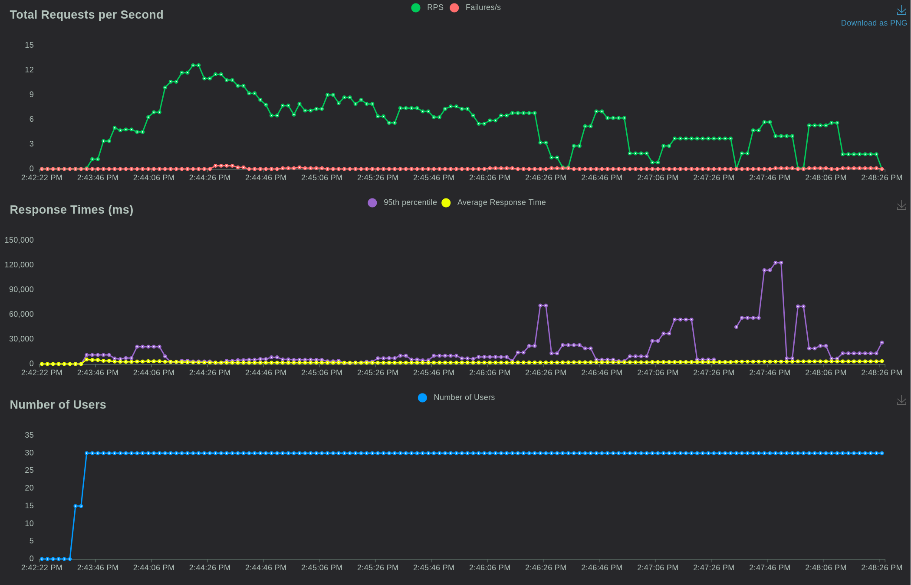
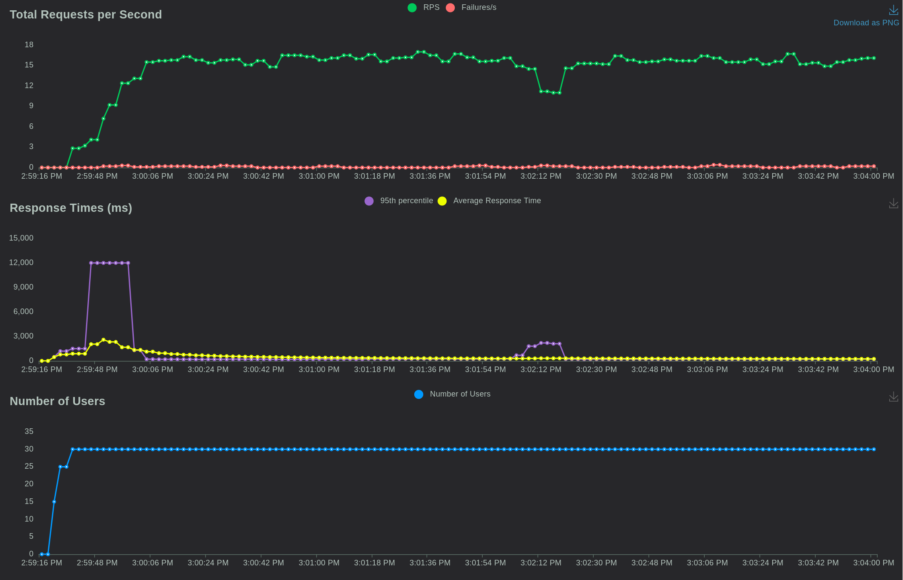
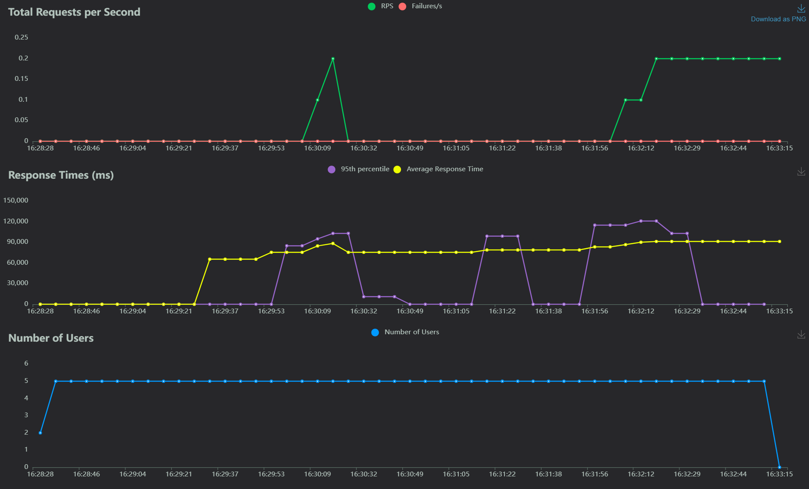

# Cloud Basic Assignment Report

#taffoni e ruggero

## Introduction 
In order to complete this project Docker containers have been used to run instances of Nextcloud and Locust, utilized to perform load testings. Other than that more containers have been created to run, respectively, Redis to implemnt caching, Nginx to perform load balancing, Postgres to menage a database.
The system has been implemented so that the users are provided with the possibility to log in and out the platform thanks to the modul Register, which can be installed and integrated to Nextcloud with its native GUI.
By default, when being created, it is possible to assign different roles to each for a new user, such as admin, simple user or a guest. If needed it is aslo possible to define more roles throught the user management functionality.
Each user has its own private storage space, which can be directly accessed by them or by directly accessing to Nextcloud and locating the specific directory. Obviously, depending on the context, this can be considered either a feature or a vulnerability, In this latter case, we could mitigate this risk by activating the built-in encryption method, which allows the admins to access all the files and at the same time prevents the content to be read by everyone but the owner of them. Upload and storage space can be limited for each user.

By properly configuring the Nginx and Redis instances, the project can be run on different machines 
..........

## Deployment
### Docker Compose file
Right after having started Docker, the whole file-storage project can be deployed by running the following docker-compose.yaml file. Its purpose is to create the correct directories where the required volumes for the containers will be sotred.
```yaml
version: '3.8'

volumes:
  nextcloud:
  db:

services:
  db:
    image: postgres:latest
    container_name: db
    environment:
      - POSTGRES_USER=nextcloud
      - POSTGRES_PASSWORD=nextcloud
      - POSTGRES_DB=nextcloud
    restart: always
    volumes:
      - db:/var/lib/mysql
    
  redis:
    image: redis:alpine
    container_name: redis

  nextcloud:
    image: nextcloud:latest
    container_name: nextcloud
    depends_on:
      - db
    volumes:
      - nextcloud:/var/www/html
    environment:
      - POSTGRES_HOST=db
      - NEXTCLOUD_ADMIN_USER=admin
      - NEXTCLOUD_ADMIN_PASSWORD=admin
      - POSTGRES_USER=nextcloud
      - POSTGRES_PASSWORD=nextcloud
      - POSTGRES_DB=nextcloud

  locust:
    image: locustio/locust
    container_name: locust
    ports:
      - "8089:8089"
    volumes:
      - ./locust:/mnt/
    command: -f /mnt/locustfile.py --host http://nextcloud:80 --users 10 --spawn-rate 1 -t 5m
    depends_on:
      - nginx

  nginx:
    image: nginx:latest
    container_name: nginx
    links:
      - nextcloud
    ports:
      - 8080:80
    volumes:
      - ./nginx.conf:/etc/nginx/conf.d/default.conf
    depends_on:
      - nextcloud
```
### Docker compose file breakdown
In this section the docker compose file is analyzed in all its components:
* the first part is used to specify the version of the Docker compose used and to define the name of the volumes used for persisten storage
```yaml
version: '3.8'

volumes:
  nextcloud:
  db:
```
* db: it's the name of the volume containing PostgressSQL, used to perfomr the database management operations. The container has been configured with a user, password and a database name. Also, a restarting policy has beeing defined and the volume mounted in a specific directory inside the host machine.
```yaml
  db:
    image: postgres:latest
    container_name: db
    environment:
      - POSTGRES_USER=nextcloud
      - POSTGRES_PASSWORD=nextcloud
      - POSTGRES_DB=nextcloud
    restart: always
    volumes:
      - db:/var/lib/mysql
  ```
* redis: creates the Redis container used for caching in Nextcloud. 
```yaml
   redis:
    image: redis:alpine
    container_name: redis
  ```
* nextcloud: the docker image used is the latest version of Nextcloud and it depends on the `db` service. The volume is mounted to the container's `/var/www/html/` directory. Reguarding the environment, its variables are set, including the database host, the admin username, the password and obviously the database name. The Nextcloud container depends ont he db one
```yaml
 nextcloud:
    image: nextcloud:latest
    container_name: nextcloud
    depends_on:
      - db
    volumes:
      - nextcloud:/var/www/html
    environment:
      - POSTGRES_HOST=db
      - NEXTCLOUD_ADMIN_USER=admin
      - NEXTCLOUD_ADMIN_PASSWORD=admin
      - POSTGRES_USER=nextcloud
      - POSTGRES_PASSWORD=nextcloud
      - POSTGRES_DB=nextcloud
```
* locust: this container is used specifically to generate load on the Nextcloud instance. Due to its testing purposes, its requires some extra care in order to allow it to work properly. It will be necessary to deactivate some security measures inside the nextcloud instance as well as to create a locustfile.py script, which will be analyzed later. The port used to access the Locust web interface is the 8089 and the volume corresponds to a local directory `./locust` mounted to the container's `/mnt/` directory. Also the default values for the host on which to perform the load tests, the number of users, the spawn rate and the duration for conducting the tests are defined. The locust container is configured to depend on the Nginx container.
```yaml
locust:
    image: locustio/locust
    container_name: locust
    ports:
      - "8089:8089"
    volumes:
      - ./locust:/mnt/
    command: -f /mnt/locustfile.py --host http://nextcloud:80 --users 10 --spawn-rate 1 -t 5m
    depends_on:
      - nginx
```
* nginx: The Nginx container depends on the Nextcloud instance, as reported in `depends_on`, and its link is connected to the Nextcloud one, as specified in `links`. The port used its the 8089. Its configuration requires a special configuration file, `nginx.conf`, which will be analyzed later.
```yaml
  nginx:
    image: nginx:latest
    container_name: nginx
    links:
      - nextcloud
    ports:
      - 8080:80
    volumes:
      - ./nginx.conf:/etc/nginx/conf.d/default.conf
    depends_on:
      - nextcloud
```
## Nginx configuration file
The configuration of Nginx is handled by both the docker-compose.yaml and the nginx.conf files. 
The nginx.conf file's code is reported below and it specifies the http configuration, which can be divided into the following blocks:
* the upstream block defines how the backend behaves by implementing a load balancing algorithm (`least_conn`, which handle new requests sending them to the server with the fewest active connections) and the address and port of the upstream server that Nginx will proxy requests to, meaning our Nextcloud instance
* the log format block has the task to gather inside the logs informations about incoming requests and upstream server responses. This process is not strictly necessary but it can be of help during a possible debugging process
* the server block has in itself the main definition of the Nginx server configuration specifying which port to listen on, the reverse proxy (with `location`) and other connection parameters
```php
upstream nextcloud_backend {
        least_conn;
        server nextcloud:80;
    }

    # Define the log format with upstream information
    log_format upstreamlog '$remote_addr - $remote_user [$time_local] "$request" '
                           'upstream_response_time $upstream_response_time msec $msec request_time $request_time '
                           'upstream_addr $upstream_addr upstream_status $upstream_status';

    server {
        listen 80;
        server_name localhost;

        # Use the defined log format for access logs
        access_log /var/log/nginx/access.log upstreamlog;

        location / {
            proxy_pass http://nextcloud_backend;
            proxy_set_header Host $host;
            proxy_set_header X-Real-IP $remote_addr;
            proxy_set_header X-Forwarded-For $proxy_add_x_forwarded_for;
            proxy_set_header X-Forwarded-Proto $scheme;
            client_max_body_size 0; # Zero means no limit
        }

        # Nginx status page configuration
        location /nginx_status {
            stub_status on;
            allow 127.0.0.1;        # Only allow access from localhost
            allow 172.23.0.0/16;    # Allow access from the Docker network
            deny all;               # Deny access to anyone else
        }
    }
```
## Load testing procedure
### locustfile.py
As said before, the Locust container requires a locust configuration file, locustfile.py, which contains precise instructions abput what the Locust instance should be able to do and know. The code is reported below.
It defines the users credential and some testing tasks whinch in this case consist on the uploading of a text file and some dummy files of different sizes (1 kB, 1MB and 1GB). Also, for cleaning purposes, part of the test consists on deleting the file after every upload.
```python
import random
from locust import HttpUser, task, between
from requests.auth import HTTPBasicAuth
import os

class NextcloudUser(HttpUser):
    auth = None
    user_name = None
    wait_time = between(2, 5)
    print("Current working directory:", os.getcwd())

    # users to test this with.
    def on_start(self):
        user_idx = random.randrange(1, 10)
        self.user_name = f'user{user_idx}'
        self.auth = HTTPBasicAuth(self.user_name, "user_password123!")
    
    # Upload txt files
    @task(10)
    def upload_file_text(self):
        with open("/mnt/test_locust_file.txt", "rb") as file:
            self.client.put(f"/remote.php/dav/files/{self.user_name}/test_locust_file.txt", data=file, auth=self.auth)
            self.client.delete(f"/remote.php/dav/files/{self.user_name}/test_locust_file.txt", data=file, auth=self.auth)
    
    # Upload big files
    @task(5)
    def upload_file_1gb(self):
        remote_path = f"/remote.php/dav/files/{self.user_name}/1gb_file_{random.randrange(0, 10)}"
        with open("/mnt/file_1gb", "rb") as file:
            self.client.put(remote_path, data=file, auth=self.auth)
            self.client.delete(remote_path, data=file, auth=self.auth)

    # Upload small files
    @task(10)
    def upload_file_1kb(self):
        remote_path = f"/remote.php/dav/files/{self.user_name}/1kb_file_{random.randrange(0, 10)}" #
        with open("/mnt/file_1kb", "rb") as file:
            self.client.put(remote_path, data=file, auth=self.auth)
            self.client.delete(remote_path, data=file, auth=self.auth)

    Upload medium files
    @task(10)
    def upload_file_1mb(self):
        remote_path = f"/remote.php/dav/files/{self.user_name}/1mb_file_{random.randrange(0, 10)}" #
        with open("/mnt/file_1mb", "rb") as file:
            self.client.put(remote_path, data=file, auth=self.auth)
            # self.client.delete(remote_path, data=file, auth=self.auth)
```

### Users generation and deletion
In order to speed up the process of creation and deletion of users of the Nextcloud instance, two different scripts have been implemented so to authomatize the process:
* for users creation
```powershell
#!/bin/bash

# Define base user name and password
baseUserName="user"
password="user_password123!"
totalUsers=40

# Loop to create each user
for ((i=1; i<totalUsers; i++)); do
    userName="${baseUserName}${i}"
    # Run the Docker command in the background
    docker exec -e OC_PASS=$password --user www-data nextcloud /var/www/html/occ user:add --password-from-env $userName &
done

# Wait for all background jobs to complete
wait

# Output completion message
echo "All users created."
```
* for deletion and clean up purposes
```powershell
#!/bin/bash

# Define base user name
baseUserName="user"
totalUsers=40

# Loop to delete each user
for ((i=1; i<totalUsers; i++)); do
    userName="${baseUserName}${i}"
    # Run the Docker command in the background
    docker exec --user www-data nextcloud php /var/www/html/occ user:delete $userName &
done

# Wait for all background jobs to complete
wait

# Output completion message
echo "All users deleted."
```
### Additional steps
In order to grant Locust load tester unrestricted access some security measures have been brought down, such as the ones thos of Nextcloud and Nginx. This result has been accomplished by running the following commands:
```powershell
docker exec --user www-data nextcloud php /var/www/html/occ config:system:set trusted_domains 2 --value=nextcloud
docker exec --user www-data nextcloud_instance php /var/www/html/occ config:system:set trusted_domains 3 --value=nginx
```
Also the `congif.php` which can be found inside the `./config` directory in the host filesystem has been modified by adding the following two lines
```php
'ratelimit.protection.enabled' => false,
'filelocking.enabled' => false,
```
This passage is cructial for the tests to succede: applying this modifications the test, when performed, won't be seen as attacks and therfore their connections won't be blocked and, at the same time, the files will also be accessible. 

### Results
Each of the tests have been performed using 40 users by selecting, throught a manual modification of the locustfile.py code, the two cases which would produce the most load:
* when for every user one file for every type is uploaded
* each user upload 1kB and 1MB files
* each user choose to upload a 1GB file
The summary graphs are reported below


The graphs reports that, even if some occasional failures happens, the system performance can be said to be the same for the first two cases. The log reports all the failures but the search for their causes can be preatty complicated. It is supposed that some of them may happen when some background task starts at the same time while some of them will fail even though no other tasks are being executed. In other cases the task won't fail even if we have additional background load.


Opposed to the previuos results, the performance related to just big files is very poor 
